# 4 Learn the workflow from case studies

We have now installed Git on our local machine, familiarised ourselves with the interfaces, and tested out a local repository. However, to realize more advantages of version control (e.g. collaboration, improving reproducibility), we will need to take it online.

This chapter will guide you through exactly how this is done, step by step, from simpler use cases to more advanced ones.

As discussed previously, there are a wide variety of hosting services. Here, only as an example, we use the well-known GitHub platform as our remote server. 

## 4.1 Starting a new single person repository

In this example, we will make a fresh repository on GitHub, make some changes from the browser, and clone a local copy so that we can work on it offline.

!!! info Note
    Chapter 4.2 describes the variation if you already have a local repository.

### Create a repo on GitHub

First, log in to GitHub. Click the "+" and then "New repository" on the top right corner.


Then, give the new repo a meaningful name (we will call it `learn-git`), and why not add a README file. Click the big green button at the bottom. Simple as that, we made a repository on GitHub.

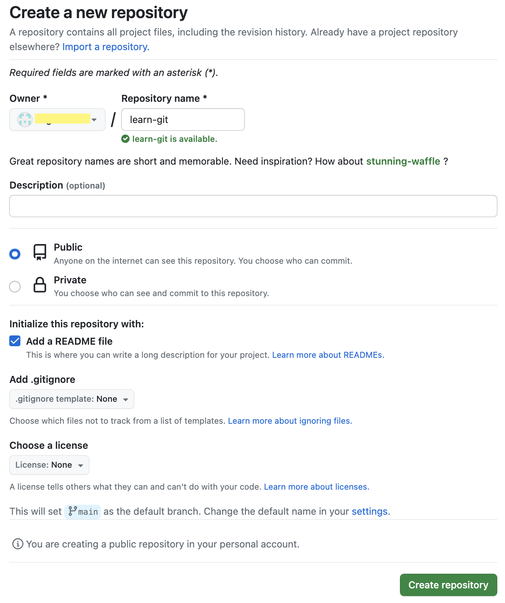

### Made changes from the browser

A very convenient feature of the online platforms like GitHub is that they allow us to make certain changes directly from the browser. For example, click into the `README.md` file, and then click on the pencil button on the right hand side:


Now we are in a text editor, and can make any changes we want to this file. Once finished, click the green "Commit changes" to save.

!!! info Note
    Why the "Commit changes", but not a simple "Save"? Remember, Git keeps a history for everything. By editing on from the browser, we have essentially done "saving the file", "stage the file" and "commit changes" with one step!


Here you can input a commit message to describe what changes you have made. Then click the green "Commit changes" button again, and all done.

### Clone the repo to local computer

For day to day coding and scripting, we probably still want to work locally on our computers with IDEs or more sophisticated editors. To do this in our new repository, we first need to make a local clone on our computer. This is very easy to do.

Go to the homepage of our repo on Github. Click the green "< > Code" button at the top right corner above the file list. Click on the "SSH" tab.


!!! info Note
    SSH is more secure than HTTPS. If you have set up your SSH keys successfully in the previous chapter, always try to use the SSH links.

Now there are several options:

- If you are working with GitHub Desktop, simply click on the link "Open with GitHub Desktop". You can choose where you want to keep the local copy.


- Otherwise, copy the line of link (with the button on the right). Go to your preferred IDE and clone the repo there. 

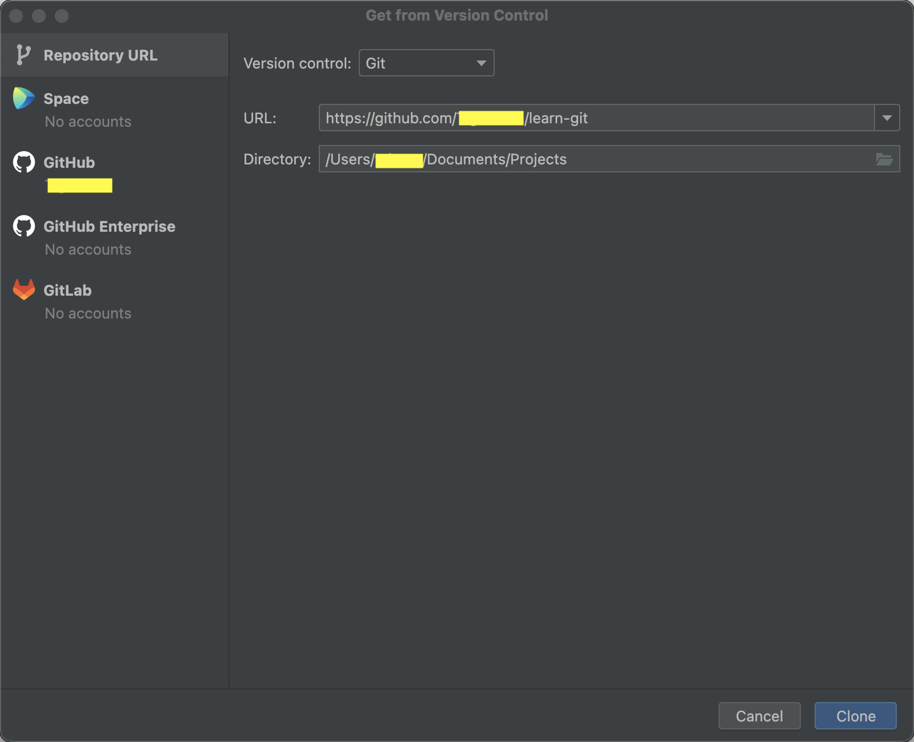

- If you work with commandlines, go to the parent folder where you want the new repo to be copied into, and then use the `git clone` command (replacing `<some-parent-folder>` and `<your-github-id>`):

```bash
cd <some-parent-folder>
git clone git@github.com:<your-github-id>/learn-git.git
```

Look inside the `learn-git` folder. You have the new repo cloned onto your computer!

### Make changes locally and keep the remote updated

As you make new changes in this folder, you can make local commits just as you did in #3.6. 

!!! example "Exercise"
    If you want to make an edit to the `README.md` file, what steps do you need to take to make the commit?

    ??? success "Solution"
        1. Edit with an editor of your choice.
        
        2. Stage `README.md` file.
        
        3. Make commit.
        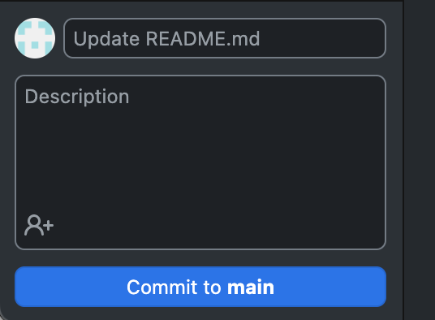

As long as you are on a single branch, the only extra step to take to update the remote is *pushing*. This sends all the local changes to the GitHub remote server.

In GitHub Desktop, this is done by simply clicking the `Push` button on the top banner:

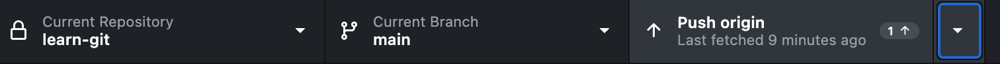

Have a look on the GitHub website. It's updated with the local changes!

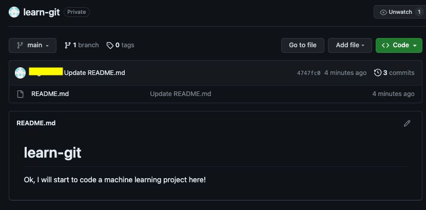

## 4.2 Setting up a new online repository for an existing local repository

Sometimes, we may have already written some code and created a local repository (like what we did in #3.6). Now we want to set up a remote repository and send our code to it, so that our local work is backed up online, and later be shared.

Here we use an example of `learn-git1` local repository with 2 files already commited.

### Publish with GitHub Desktop

If you use GitHub Desktop, the process is very easy. On the top banner, click the `Publish repository` button.

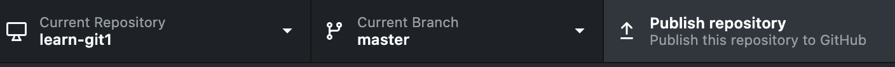

Then enter descriptions and click publish! All done.

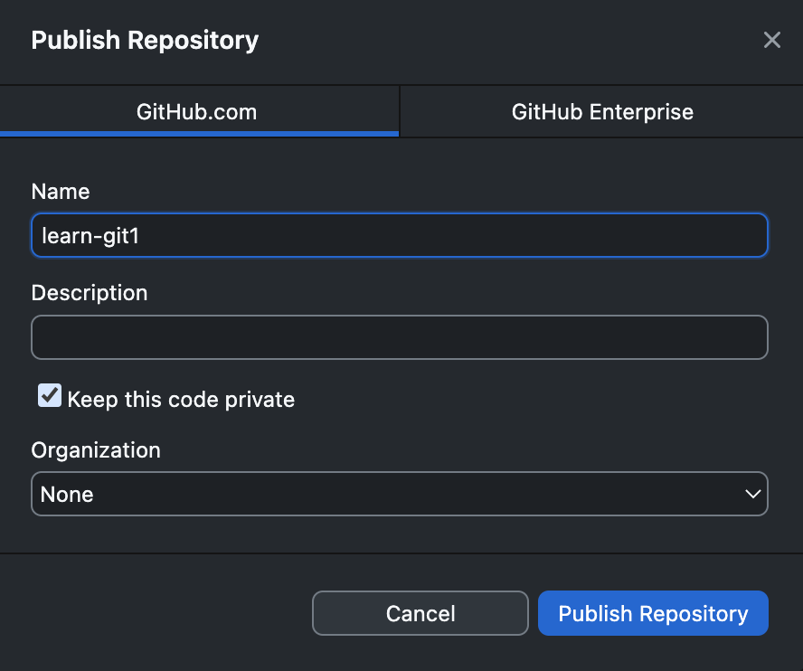

### Without GitHub Desktop

The whole process is similar to Chapter 4.1, except in some small details. 

### Create a repo on GitHub

First, log in to GitHub. Click the "+" and then "New repository" on the top right corner.


Then, give the new repo a meaningful name (probably sensible to be the same as your local folder name). To make life simple, do NOT initialize or add any files.


!!! example "Exercise"
    What will happen if we initialized with, e.g. a README file?

    ??? success "Solution"
        The remote repo on Github will have the README file, while our local repo does not. On the other hand, remember that our local repo has some existing codes that the remote does not have. Therefore, as soon as we try to link the two together, there will be a conflict.

Click the big green button at the bottom to create the repo.

### Connect to the local repo

Since the new online repository is completely empty, GitHub then shows you exactly how to connect to the local repository.

With your IDE, go to the version control tab and look for `Manage remote`. 

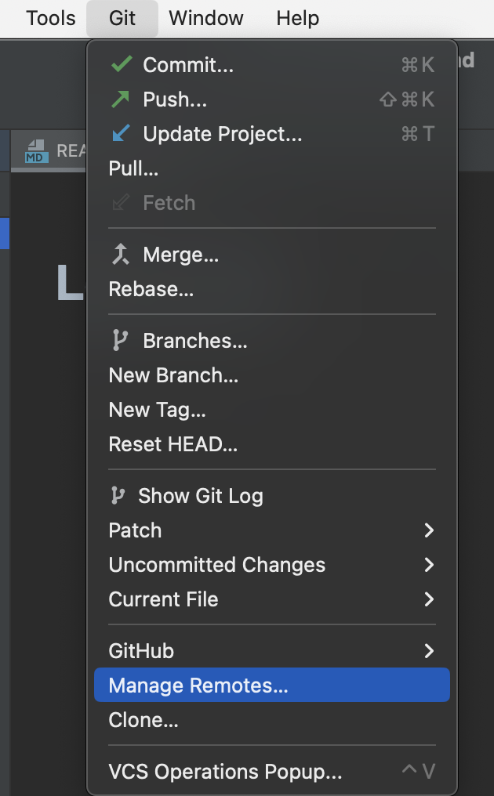

Click `Add remote`, and paste in the URL to the GitHub repository page.


Now, do a *push*, which will update all the existing local commits to the remote.

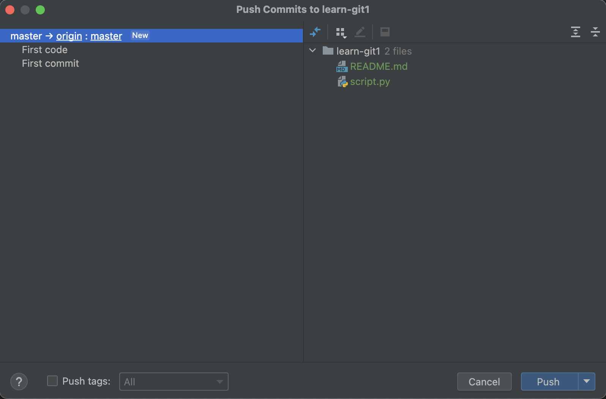

That's all done! Have a look on the GitHub website. It's updated with the local changes!

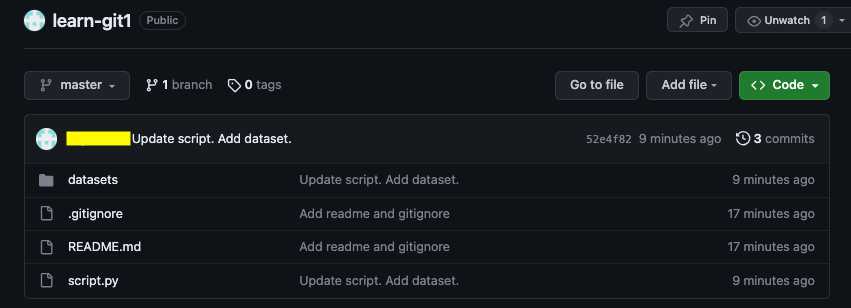


## 4.3 Making branches and collaborating

Now the project is growing, and some colleagues want to work on the code together. Without Git, this would be a slow process, as only one of you can work on the code at a time. Otherwise, it would be difficult to combine the changes.

With Git, however, code collaboration can work very efficiently. This is achieved by branching, merging and pull requests.

### Adding collaborators

You may have noticed the setting of *public* or *private* during the creation of the GitHub repository. They control whether this repository is visible to everyone. Being public, however, doesn't mean anyone can change the code in your repository.

By default, only you, the repository owner, can contribute to the repository (push code). To add collaborators, go to the repository settings, and then "collaborators".


### Editing on a new branch

As explained in Chapter 3 and 5, the purpose of *branches* is to separate different strands of work. 

Here for example, while your colleague will write some hypothesis tests on the data, you would like to make more plots to visualize data. So, before coding, you create and checkout a branch `visualization`.

> *Checkout* simply means making this the active branch, so that the following edits will be made on this branch.

In GitHub Desktop, click the branch box on the top banner, and click new branch.


Enter the new branch name and create.


After switching, the active branch is now `visualization` which can be seen on the top banner.

Alternatively, in PyCharm, create the new branch from the Git menu:


To verify the active branch, look for the Git symbol at the bottom of the screen. Most IDEs have a similar display.

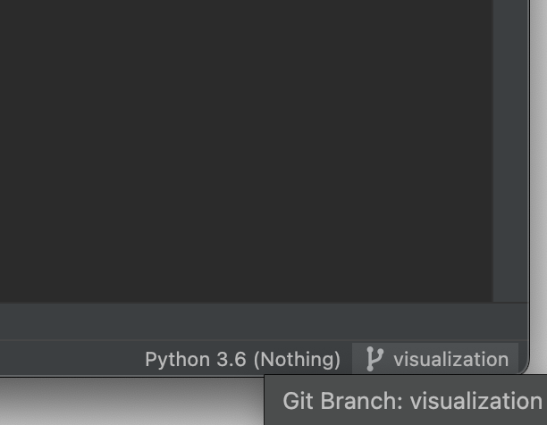

Now you can modify the code, without the need to worry about what your colleague is doing. After some hard work in coding, you can stage, commit and push as usual. Everything is saved on the new `visualization` branch.

### Merging and pull requests

When you think you have finished all the codes related to `visualization`, you will want to *merge* this branch back to the base branch (in our case `master`), so that collaborators and users will be able to see and use these codes by default.

To do this, we first open a *pull request* (PR). 

Go to the repository webpage on GitHub, and click on the "Pull requests" tab. GitHub likely realizes that you are opening the pull request for the most recent branch, `visualization`. Click the green "Compare & pull request" button.


!!! info Note
    If there is no "Compare & pull request" prompt, click on the "New pull request" green button instead, and then manually choose which branch to merge.

Then, GitHub will show what is different between the `visualization` and `master` branches. 


When opening the pull request, remember to include a clear description of what changes are made in the new branch.


 It may seem a little unnecessary if it is only you and your colleague sitting right next to your desk coding this together, but this will become really important when 15 collaborators end up working on the same project, most of whom only checking in once in a while...

 On the right of the screen, there are several further details you can add to the PR:

- Reviewers are the people who will read and check your new code. This is usually different from the author of this PR. The importance of code review is covered in other parts of the CodeRep course.
- Assignees are the people who are responsible to work on the PR until it's merged into the master.
- Labels, projects and milestones are all 'tags' to signify the importance of the code in this PR. They are commonly used in larger projects.

Let's go ahead and open the PR.

### Conflict resolution

In this case, your colleague has already finished their part on hypothesis tests. They have merged to `master` before you opened `visualization` PR. This has caused a conflict in the codes, which GitHub detects:

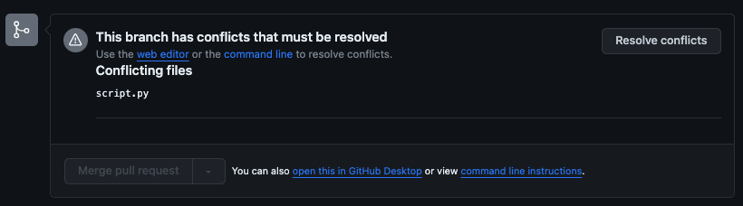

!!! info "Note"
    What exactly is causing this conflict?
    
    In short, both `master` and `visualization` have changed the same file(s).

    In detail: When you started working on the master branch, you started from the commit labelled "SPLIT" on `master` branch. Now, you are trying to merge the "CURRENT" commit on `master` with "LAST" commit on `visualization`. Both "CURRENT" and "LAST" include changeds to `script.py`, but independent changes, from "SPLIT". Therefore, Git is not sure how to merge these.

Luckily, with Git, this is not scary at all. There are several ways to make this merge, and here we introduce a recommended workflow. 

> Always try to keep `master` (or `main` or any base branches) clean.

On the local computer, do a *pull*. Literally, this is the opposite of *push*, so the local is up-to-date with remote. Now the local repository also contains the work your colleague has done.

In GitHub Desktop: 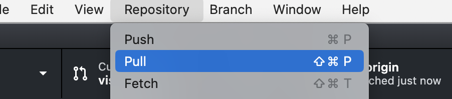

In PyCharm: 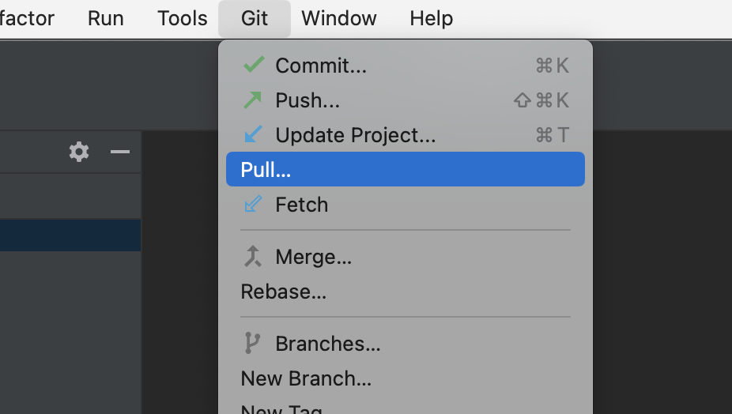

Check that you are still on `visualization`. Then *merge* `master` into `visualization`.

In GitHub Desktop, there is a quick one-step button to do this: 

In PyCharm or other IDEs, go to merge: 

!!! info "Which way to merge?"
    The direction of merging can be confusing in the beginning. If you want to merge A into B (B end up containing changes of A), stay on (checkout) B, and perform merge A.

Either way, you will hopefully be prompted the same conflict seen on the GitHub. This will automatically tell any IDE you use, that you are trying to resolve a merge conflict. For example in PyCharm,


Click resolve, and then click merge.


This will then bring up the Merge Revision window.


Here, one branch to merge is on the left (e.g. `visualization`), the other to merge on the right (e.g. `master`), and your desired merge results is in the middle. You can pick and choose whether you want to keep each changes on the two branches by clicking the "<<" or ">>" arrows next to the changes.

In this case, both branches are adding new codes, so we want to include all changes. Finally click apply.

If there are multiple files that have been changed both sides, go through this process for each file. Hopefully, in the end, everything will be resolved.

GitHub Desktop shows this good new explicitly: 


Click "contiunue merging", to make a commit after the merge work. Alternatively, in IDEs, simply make a new commit for all the merged files.

Now, make a *push* again, and look at the PR page.


Great, no more conflicts to merge! The new code is now ready to be merged into the base branch - if the reviewer approves. So, suppose your colleague has no objection, click the green "Merge pull request" button and confirm.

All the new visualization codes are now in the `master` branch. Meanwhile, the `visualization` branch is no longer needed, so GitHub suggests that you can delete that branch.


!!! info "Important"
    Why all the convoluted steps? In these steps, we introduced how to keep our working feature branch up-to-date with the new developments on `master`. In general, it is **a very good practice** to frequently pull and merge `master` (or another base branch) into the feature branch, instead of after all the work has finished. This way, it is less likely to see conflicts, and even if there are, they will be smaller ones which do not require a lot of head-scratching to resolve.

