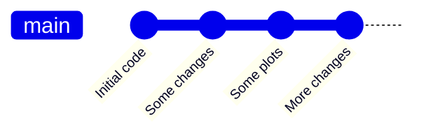
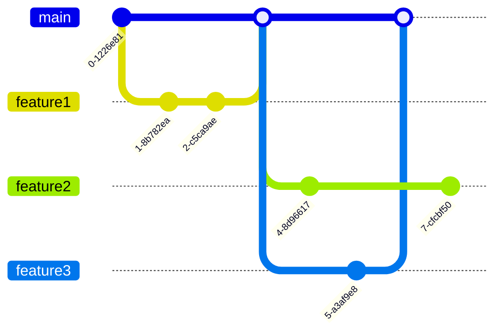

# 5. Advanced topics

## 5.1 Git branching strategies

So far, we have familiarised ourselves with a few simple workflows when using Git. In this section, we will have a birds-eye view of the branching strategies and discuss the choices. 

A note for the term **flow** - since a Git workflow always consists of stashing, commiting, pushing etc., whenever people talk about a Git-related *flow*, it is generally referring to the remaining, more dynamic parts of the workflow, particularly the **branching and merging strategies**.

An organized and efficient workflow choice can be essential to the success of a project. Here we introduce four most common workflows used in Git.

### Centralized workflow
The simplest case which we have seen in ==Case Study 0==. There is only one branch and all changes are made on this branch. This is a nice and simple way to save *checkpoints* for your own work. 


However, the centralized workflow does not allow easy collaboration, because every time two people make changes simultaneously, it will create a conflict on the branch. The following workflows can provide a more streamlined collaboration.

### Feature branch workflow
To overcome the limit with the centralized workflow, we can put a chunk of new work on a dedicated branch. This is what we did in ==case study 2==, and the method has several advantages
- allows multiple collaborators to work simultaneously on different features, backing up their work along the way
- no disruption to the code on `main` branch before the feature code is ready, suitable for continuous integration environment
- allows discussions and assistances for a feature through e.g. pull requests


The feature branch flow is the conventional workflow for repositories hosted on GitHub (partly because the UIs of GitHub is initially designed around it). Hence, it is also commonly referred to as the *GitHub flow*.

### Gitflow workflow
The feature branch workflow is great for packages which can have continuous updates, but for many bigger projects, or softwares with a larger user base, it is important to have the concept of *release*. Users will want / need to know which "version number" they are using.

This is where the Gitflow workflow comes in. Building upon the feature branch workflow, it adds several branches with specific roles with rules for when and how to merge.

The main development work happens exactly like in the feature branch workflow, except that the features branch off and merge into the `develop` branch instead of the `main`. When the code in `develop` is ready to be released, the changes are then merged back to the `main`. The commits on `main` are always production-ready, and each has a release number.


Another dedicated branch is the `hotfix` branch, which serves (only) to fix bugs should they appear on the `main`.


Other possible branches include the `release` branches, which is used to prepare for a release (prepare the release metadata, fixing bugs before the release, etc.).


## 5.2 Project management with GitHub

Project management with GitHub involves using the various features and tools provided by GitHub to plan, organize, track progress, and collaborate on software development and other types of projects. GitHub provides a platform for version control using Git, but it also offers project management capabilities to help teams streamline their workflow. Here's a step-by-step guide on how to use GitHub for project management:

**Create a GitHub Repository**:

Start by creating a GitHub repository for your project. This will serve as the central repository where all your project files and code are stored.

**Use Issues for Task Tracking**:

GitHub Issues are a great way to track tasks, bugs, and feature requests. You can create issues for different aspects of your project, assign them to team members, label them for categorization, and set milestones.

**Labels and Milestones**:

Use labels to categorize issues by type, priority, or any other relevant criteria. Milestones can be used to group related issues together, helping you plan sprints or releases.

**Projects**:

GitHub Projects are a powerful way to create Kanban-style boards or custom project boards. You can organize and prioritize issues within these boards and track their progress from "To Do" to "In Progress" to "Done."

**Pull Requests**:

For code changes, create branches in your repository and submit pull requests to merge them into the main branch (usually master or main). Pull requests serve as a way to review code changes, discuss them, and ensure quality control before merging.

**Assignees and Reviewers**:

Assign issues and pull requests to specific team members. You can also request reviews from others before merging code changes.

**GitHub Actions**:

Use GitHub Actions to automate workflows, such as continuous integration and continuous deployment (CI/CD). This helps in automatically testing and deploying your code when changes are pushed to the repository.

**Wiki and Documentation**:

GitHub provides a wiki feature where you can document your project. This is a great place to keep project-related information, user guides, and other documentation.

**Notifications and Discussions**:

GitHub notifies team members about changes, mentions, and updates related to issues and pull requests. Use the discussion features to have conversations around specific topics.

**Integrations**:

GitHub offers numerous integrations with third-party tools like Slack, Trello, and more. These integrations can help streamline your project management workflow.

**Security Scanning**:

GitHub provides security scanning features to help identify and remediate security vulnerabilities in your codebase.

**Analytics and Insights**:

GitHub provides various analytics and insights to track the progress of your project, codebase contributions, and more.

**Collaboration Guidelines**:

Establish clear collaboration guidelines and workflows for your team, including branch naming conventions, code review processes, and issue triage.

**Documentation Best Practices**:

Encourage the team to keep code and project documentation up to date. A well-documented project is easier to manage.

**Regular Reviews and Retrospectives**:

Conduct regular team reviews and retrospectives to evaluate your project management process and make improvements.

By following these steps and utilizing GitHub's features effectively, you can streamline project management, enhance collaboration, and ensure the success of your software development or other projects. Let's walk through an example of how to do project management using GitHub for a hypothetical software development project. In this scenario, we'll create a simple project to build a website. Here's a step-by-step guide:

_Step 1: Create a GitHub Repository_

1. Go to GitHub (https://github.com/) and log in to your account.

2. Click the "+" sign in the top right corner and select "New Repository."

3. Name your repository (e.g., "Website-Project").

4. Choose visibility (public or private) and other settings as needed.

5. Click "Create repository."

_Step 2: Create Issues_

1. Inside your repository, click on the "Issues" tab.

2. Click the green "New issue" button.

3. Create issues for various tasks, such as "Design homepage," "Develop contact form," and "Test website on mobile devices."

4. Assign these issues to team members by mentioning their GitHub usernames.

5. Add labels (e.g., "bug," "enhancement," "feature") to categorize issues.

_Step 3: Create Milestones_

1. Click the "Milestones" tab in the "Issues" section.

2. Create milestones for project phases, such as "Design Phase," "Development Phase," and "Testing Phase."

3. Assign issues to the appropriate milestones.

_Step 4: Set Up a GitHub Project Board_

1. Click the "Projects" tab.

2. Create a new project board and name it (e.g., "Website Project Board").

3. Add columns to the board, like "To Do," "In Progress," "Review," and "Done."

4. Add issues to the "To Do" column by dragging and dropping them from the issues list.

_Step 5: Collaborate on Code with Pull Requests_

1. Create a branch for a specific feature or task (e.g., `feature/homepage-design`).

2. Make code changes in that branch.

3. Create a pull request (PR) to merge changes into the main branch.

4. Request code reviews from team members.

5. Discuss and make necessary changes in the PR conversation.

6. Merge the PR when it's approved.

_Step 6: Automate with GitHub Actions_

1. Go to the "Actions" tab in your repository.

2. Create workflows using GitHub Actions to automate tasks like code testing and deployment.

3. Configure workflows with YAML files in your repository.

_Step 7: Wiki and Documentation_

1. Create a Wiki by going to the "Wiki" tab and add documentation for the project.

2. Document coding standards, deployment processes, and other relevant information.

_Step 8: Collaborate and Discuss_

1. Use GitHub discussions or comments on issues and pull requests to have conversations with your team.

2. Notify team members by mentioning their GitHub usernames.

_Step 9: Review Analytics and Insights_

1. Use the "Insights" tab in your repository to track code contributions, issue progress, and project statistics.

2. Analyze these insights to make informed decisions.

_Step 10: Integrate with Third-party Tools_

1. Integrate GitHub with tools like Slack or Trello to receive notifications and enhance collaboration.

_Step 11: Conduct Regular Reviews and Retrospectives_

1. Schedule regular team meetings to review project progress and discuss improvements.

2. Use the project board, issues, and analytics to guide your discussions.

By following these steps and adapting them to your project's needs, you can effectively manage your software development project using GitHub. It provides a structured and collaborative environment to track tasks, manage code, automate processes, and ensure successful project delivery.


## 5.3 Publishing webpages with GitHub

Publishing webpages with GitHub is straightforward, and it's commonly done using GitHub Pages, which is a free hosting service provided by GitHub. Here are the steps to publish webpages with GitHub:

_Step 1: Create a GitHub Repository_

1. Log in to your GitHub account (or create one if you don't have it).

2. Click the "+" sign in the top right corner and select "New Repository."

3. Name your repository following this format: `&lt;your-username>.github.io`. For example, if your username is "johnsmith," your repository should be named "johnsmith.github.io."

4. Choose visibility (public or private) and other settings as needed.

5. Click "Create repository."

_Step 2: Create Your Webpage_

1. Inside your repository, you can create your webpage files. The main entry point for your webpage should be named `index.html`. You can also include CSS, JavaScript, and other assets as needed.

_Step 3: Commit and Push Your Webpage Files_

1. Add your webpage files to your repository.

   ```

   git add .

   ```

2. Commit the changes.

   ```

   git commit -m "Initial commit"

   ```

3. Push the changes to your GitHub repository.

   ```

   git push origin main

   ```

   (Note: GitHub Pages typically uses the `main` branch as the source for your webpage, but it can also use the `master` branch.)

_Step 4: Enable GitHub Pages_

1. Go to your GitHub repository on the GitHub website.

2. Click on the "Settings" tab.

3. Scroll down to the "GitHub Pages" section.

_Step 5: Configure GitHub Pages_

1. Under "Source," select the branch that contains your webpage files. This is usually the `main` branch.

2. Once you select the branch, GitHub Pages will automatically build and deploy your webpage.

3. Optionally, you can choose a custom domain name under the "Custom domain" section if you have one.

_Step 6: Save and Access Your Published Webpage_

1. Scroll down and click "Save" to enable GitHub Pages with your chosen settings.

2. GitHub Pages will provide a URL where your webpage is published. It will typically be in the format: `https://&lt;your-username>.github.io`.

_Step 7: Access Your Published Webpage_

1. Open a web browser and navigate to the URL provided by GitHub Pages.

2. You should see your published webpage.

Now, your webpage is live and publicly accessible on the internet through GitHub Pages. Any changes you make to your repository, including updating your HTML, CSS, or JavaScript files and pushing those changes to your GitHub repository, will automatically update your webpage. GitHub Pages is a powerful and free way to host static websites and documentation, and it's widely used for personal websites, project documentation, and more.


## 5.3 CI/CI with GitHub 

Continuous Integration and Continuous Deployment (CI/CD) with GitHub involves automating the process of building, testing, and deploying your code whenever changes are made to your GitHub repository. Below, I'll provide a step-by-step example of setting up CI/CD using GitHub Actions, which is GitHub's built-in CI/CD tool.

In this example, we'll assume you have a GitHub repository containing a simple web application that you want to build, test, and deploy to a web server whenever changes are pushed to the repository.

_Step 1: Set Up Your GitHub Repository_

1. Create a GitHub repository for your project if you haven't already.

_Step 2: Create a GitHub Actions Workflow_

GitHub Actions workflows are defined in YAML files within your repository. Here's how to create one:

1. In your GitHub repository, create a `.github/workflows` directory if it doesn't exist.

2. Inside the `workflows` directory, create a new YAML file (e.g., `ci-cd.yml`) for your CI/CD workflow.

_Step 3: Define Your Workflow_

In your `ci-cd.yml` file, define the steps for your workflow. Below is a simple example for a Node.js application:

```yaml

name: CI/CD Pipeline

on:

  push:

    branches:

      - main

jobs:

  build:

    runs-on: ubuntu-latest

    steps:

    - name: Checkout code

      uses: actions/checkout@v2

    - name: Set up Node.js

      uses: actions/setup-node@v2

      with:

        node-version: 14

    - name: Install dependencies

      run: npm install

    - name: Build and test

      run: npm run build

    - name: Deploy to server

      run: |

        ssh ${{ secrets.SERVER_USER }}@${{ secrets.SERVER_IP }} 'cd /path/to/your/app && git pull && npm install && npm run build'

```

This workflow does the following:

- It triggers on pushes to the `main` branch.

- It checks out the code, sets up Node.js, installs dependencies, builds the application, and then deploys it to a server using SSH.

_Step 4: Set Up Secrets_

For security reasons, don't hardcode sensitive information (e.g., SSH keys) directly into your workflow file. Instead, use GitHub secrets. To set up secrets:

1. In your repository, go to "Settings" > "Secrets."

2. Click "New repository secret" and add secrets like `SERVER_USER`, `SERVER_IP`, and any others your workflow needs.

_Step 5: Commit and Push Your Workflow_

Commit your `ci-cd.yml` file to your repository and push it to GitHub.

_Step 6: GitHub Actions Execution_

GitHub Actions will automatically detect your workflow and execute it whenever changes are pushed to the `main` branch. You can monitor the progress of your workflow by going to the "Actions" tab in your repository on GitHub.

_Step 7: Access Your Deployed Application_

Once the workflow is successful, your application is deployed. You can access it using the URL where your server is hosted.

This is a simplified example, and real-world CI/CD workflows can be much more complex, depending on your project's requirements. You can extend the workflow to include additional steps like testing, deployment to multiple environments, notifications, and more. The key is to define your workflow steps in the YAML file, set up secrets for sensitive information, and let GitHub Actions handle the automation.
