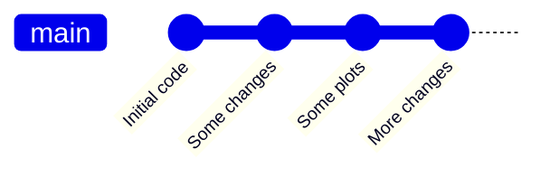
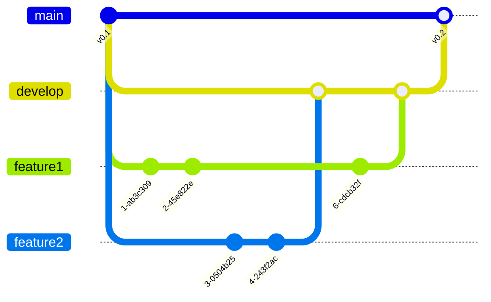
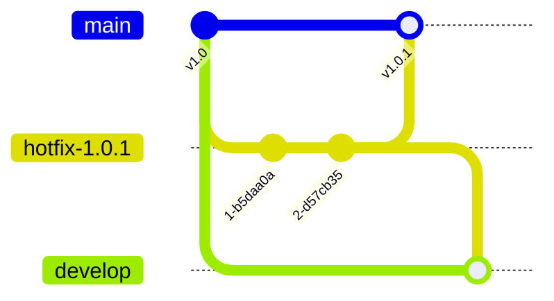

## 5.1 Git branching strategies

So far, we have familiarised ourselves with a few simple workflows when using Git. In this section, we will have a birds-eye view of the branching strategies and discuss the choices. 

A note for the term **flow** - since a Git workflow always consists of stashing, commiting, pushing etc., whenever people talk about a Git-related *flow*, it is generally referring to the remaining, more dynamic parts of the workflow, particularly the **branching and merging strategies**.

An organized and efficient workflow choice can be essential to the success of a project. Here we introduce four most common workflows used in Git.

### Centralized workflow
The simplest case which we have seen in ==Case Study 0==. There is only one branch and all changes are made on this branch. This is a nice and simple way to save *checkpoints* for your own work. 

However, the centralized workflow does not allow easy collaboration, because every time two people make changes simultaneously, it will create a conflict on the branch. The following workflows can provide a more streamlined collaboration.

### Feature branch workflow
To overcome the limit with the centralized workflow, we can put a chunk of new work on a dedicated branch. This is what we did in ==case study 2==, and the method has several advantages
- allows multiple collaborators to work simultaneously on different features, backing up their work along the way
- no disruption to the code on `main` branch before the feature code is ready, suitable for continuous integration environment
- allows discussions and assistances for a feature through e.g. pull requests

The feature branch flow is the conventional workflow for repositories hosted on GitHub (partly because the UIs of GitHub is initially designed around it). Hence, it is also commonly referred to as the *GitHub flow*.

## Gitflow workflow
The feature branch workflow is great for packages which can have continuous updates, but for many bigger projects, or softwares with a larger user base, it is important to have the concept of *release*. Users will want / need to know which "version number" they are using.

This is where the Gitflow workflow comes in. Building upon the feature branch workflow, it adds several branches with specific roles with rules for when and how to merge.

The main development work happens exactly like in the feature branch workflow, except that the features branch off and merge into the `develop` branch instead of the `main`. When the code in `develop` is ready to be released, the changes are then merged back to the `main`. The commits on `main` are always production-ready, and each has a release number.

Another dedicated branch is the `hotfix` branch, which serves (only) to fix bugs should they appear on the `main`.

Other possible branches include the `release` branches, which is used to prepare for a release (prepare the release metadata, fixing bugs before the release, etc.).

